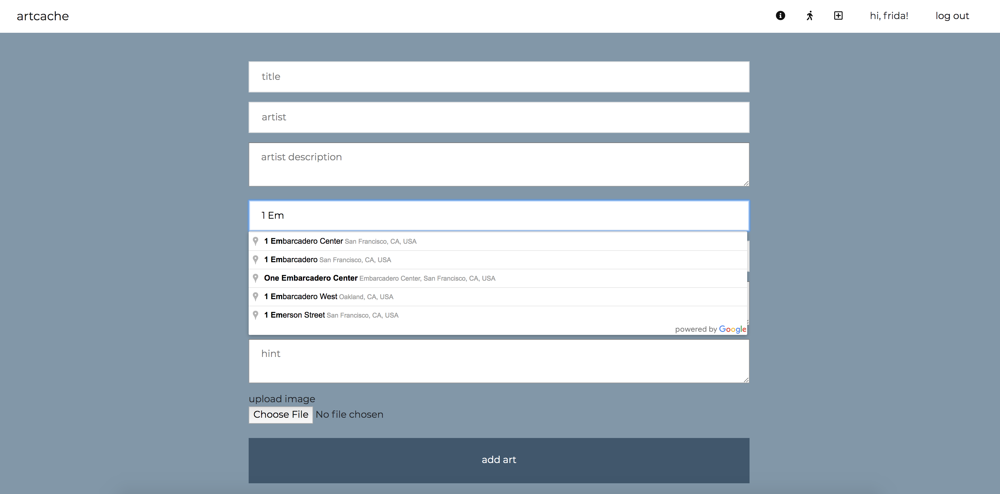

# Artcache 
A web application to discover, log, and share public art in San Francisco. The idea came from geocaching - a digital scavenger hunt. 

### Goals of the project 
* start a database of public art in SF 
* allow users to explore the city through finding public art 

### Start Artcaching 
__map views__
* heatmap: the density of public artworks by count 
* point map: zoom in on the map to see art sites, click a site for more information and to log a site

__tour__
* see an art tour through different San Francisco Neighborhoods 

__add art__
* add new artworks for other users to find 

__log__
* add a photo and comment of art 

### Public Data Sources 

* 1% Art Program: A city-wide program that requires all projects involving new building in Downtown San Francisco to provide 
public art equal to 1% of total construction cost. It was established by the 1985 Downtown plan and governed by Section 
429 of the Planning Code.

* Civic Art: Includes publicly-sited works in the Civic Art Collection including historic monuments, murals, and artworks 
commissioned through the city's Public Art Program.

* User Art: added by YOU

###  

### Contributions & Known Issues 

Contributions are welcome and for known issues check out the issues board. The next release of artcache with improved UI, bug fixes, and expanded tour feature coming soon. 

### Final

I made this app while learning web development and CS fundamentals and Hackbright Academy in June 2019. It is my first independent web app and is still a work in progress. 
